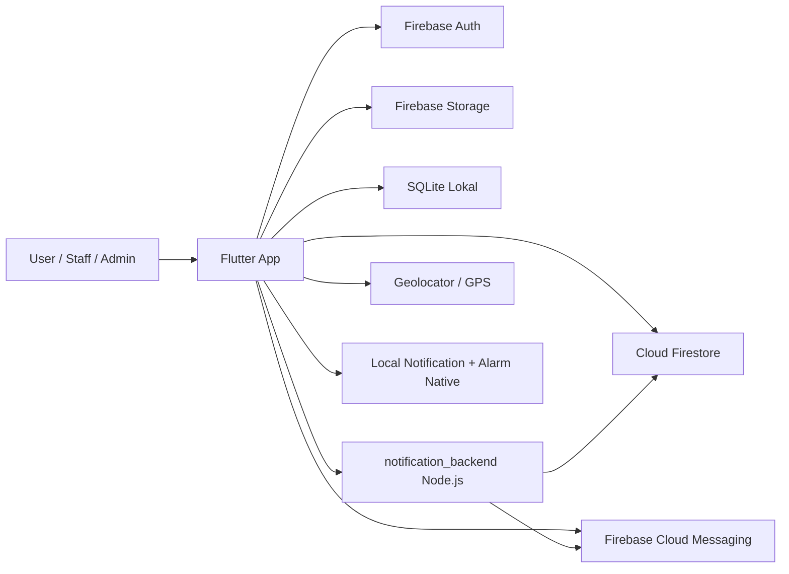

# ANALISIS PROJECT - management_emergency

Dokumen ini merangkum hasil analisis source code Flutter + Firebase pada project `management_emergency` di `D:\KOMPUTASI SERULER\management_emergency`.

## 1. Ringkasan Aplikasi

Aplikasi ini adalah sistem manajemen emergency berbasis mobile untuk:
- Pelapor mengirim alert ke departemen tujuan.
- Staff departemen menerima notifikasi, mengambil alert, menuju lokasi, lalu menutup report.
- Admin mengelola user, staff, departemen, dan seluruh riwayat alert.

Teknologi utama pada versi lama:
- Flutter
- Firebase Auth
- Cloud Firestore
- Firebase Storage
- Firebase Cloud Messaging
- Flutter Local Notifications
- SQLite lokal untuk cache dan sinkronisasi
- Backend Node.js kecil khusus notifikasi FCM

## 2. Struktur Folder Project

### Folder utama
- `android/`, `ios/`, `web/`, `windows/`, `macos/`, `linux/` - platform Flutter
- `assets/` - logo, background login, dan audio alarm
- `functions/` - source fungsi Firebase/pendukung lama
- `lib/` - source utama aplikasi Flutter
- `notification_backend/` - backend Node.js untuk kirim notifikasi
- `outputs/` - file output/hasil build
- `test/` - test Flutter

### Struktur `lib/`
- `lib/main.dart`
- `lib/firebase_options.dart`
- `lib/config/backend_config.dart`
- `lib/data/department_data.dart`
- `lib/database/db_helper.dart`
- `lib/database/local_database.dart`
- `lib/models/user_model.dart`
- `lib/models/report_model.dart`
- `lib/screens/`
  - `admin.dart`
  - `department.dart`
  - `history.dart`
  - `home.dart`
  - `login.dart`
  - `main_screen.dart`
  - `profile.dart`
  - `register.dart`
  - `report.dart`
  - `staff_register.dart`
  - `support_request_screen.dart`
- `lib/services/`
  - `alert_notification_api.dart`
  - `legacy_sqlite_migration_service.dart`
  - `location_service.dart`
  - `push_notification_service.dart`
- `lib/theme/app_theme.dart`
- `lib/widgets/`
  - `brand_header.dart`
  - `custom_textfield.dart`
  - `emergency_button.dart`
  - `photo_picker_card.dart`
  - `section_card.dart`
  - `user_photo_avatar.dart`

## 3. Semua Halaman / Screen

### Screen utama
- `AppBootstrapScreen` - bootstrap Firebase, migrasi SQLite lama, cek sesi login.
- `UnsupportedPlatformScreen` - tampil bila bukan Android/iOS.
- `LoginScreen`
- `RegisterScreen`
- `StaffRegisterScreen`
- `MainScreen`
- `HomeScreen`
- `ReportScreen`
- `SupportRequestScreen`
- `DepartmentScreen`
- `HistoryScreen`
- `ProfileScreen`
- `AdminScreen`

### Subpage / screen internal
- `EmployeeDirectoryScreen`
- `UserDirectoryScreen`
- `_DepartmentDetailScreen`
- `_CreateStaffScreen`
- `_EditUserScreen`
- `_UserDetailScreen`
- `_HistoryDetailScreen`
- `_EditProfileScreen`
- `_CompletionProofScreen`
- `_AlertMapScreen`
- `_LocationMapCard`
- `_ReportImage`
- Bottom sheet detail alert, rating prompt, dan pilih foto

## 4. Routing / Navigasi

### Route statis
- `/login` -> `LoginScreen`
- `/register` -> `RegisterScreen`
- `/staff-register` -> `StaffRegisterScreen`

### Alur navigasi utama
- `main.dart` -> bootstrap -> jika ada sesi aktif masuk ke `MainScreen`
- jika belum login -> `LoginScreen`
- `LoginScreen` -> register user atau staff via bottom sheet
- `MainScreen` menampilkan tab berbeda berdasarkan role:
  - admin
  - staff
  - user

### State management
- Tidak memakai Provider/BLoC/Riverpod.
- State dikelola dengan:
  - `StatefulWidget`
  - `setState`
  - `Timer.periodic`
  - `IndexedStack`
  - `FutureBuilder`/load manual di beberapa screen

## 5. Authentication

### Sistem autentikasi yang dipakai
- Firebase Authentication
- Metode: Email/Password

### Pola login aplikasi
- UI login menerima `username` atau `email` + PIN.
- PIN divalidasi minimal 6 digit angka.
- `DBHelper.loginUser()` akan:
  - resolve username ke email
  - coba login dari cache lokal
  - fallback ke Firebase Auth
  - fallback lagi ke data Firestore lokal bila perlu

### Role yang ada
- `admin`
- `staff`
- `user`

### Approval staff
- `staff` bisa berstatus:
  - `pending`
  - `approved`
  - `rejected`
- Staff `pending/rejected` tidak boleh masuk dashboard.

### Admin default
- Email default: `admin@emergency.local`
- Password default: `123456`
- Disiapkan otomatis bila diperlukan.

## 6. Model Data

### `UserModel`
Field:
- `id`
- `name`
- `username`
- `email`
- `password`
- `role`
- `department`
- `jobFunction`
- `phoneNumber`
- `photoPath`
- `approvalStatus`
- `approvedBy`
- `approvedAt`

Helper:
- `isAdmin`
- `isStaff`
- `isUser`
- `isApproved`

### `ReportModel`
Field:
- `id`
- `department`
- `description`
- `location`
- `imagePath`
- `imageData`
- `timestamp`
- `reporterName`
- `reporterEmail`
- `sourceDepartment`
- `status`
- `completionDescription`
- `completionImagePath`
- `completionImageData`
- `completedAt`
- `assignedStaffName`
- `assignedStaffEmail`
- `responderLocation`
- `responderLocationUpdatedAt`
- `progressStartedAt`
- `arrivedAt`
- `resolutionMinutes`
- `ratingScore`
- `ratingComment`
- `ratedAt`

### `DepartmentInfo`
Dipakai untuk metadata departemen:
- `ALERT SECURITY`
- `ALERT FIRE STATION`
- `ALERT MEDICAL`
- `IT HELPDESK`

## 7. Fitur Lengkap

### Fitur pelapor/user
- Registrasi akun user
- Login dengan username atau email
- Kirim alert ke departemen tujuan
- Ambil lokasi GPS otomatis
- Tulis deskripsi alert
- Upload foto kejadian
- Input suara ke deskripsi dengan speech-to-text
- Lihat status alert aktif
- Lihat riwayat alert
- Beri rating setelah alert selesai
- Edit profil
- Logout

### Fitur staff
- Registrasi pengajuan staff
- Menunggu approval admin
- Dashboard alert departemen
- Polling alert baru
- Push notification dengan alarm
- Ambil alert menjadi `Progress`
- Sync lokasi responder berkala
- Deteksi tiba di lokasi berdasarkan radius
- Upload bukti penyelesaian
- Tutup alert menjadi `Close`
- Lihat riwayat staff
- Beri rating layanan jika relevan
- Minta bantuan ke departemen lain
- Edit profil
- Logout

### Fitur admin
- Dashboard ringkasan alert dan user
- Lihat semua user dan staff
- Approve / reject staff
- Tambah staff langsung
- Edit user/staff
- Hapus user
- Lihat detail user
- Lihat detail departemen
- Lihat semua report
- Hapus riwayat report
- Statistik alert per departemen
- Logout

### Fitur teknis tambahan
- Migrasi data SQLite lama
- Cache sesi login di SQLite lokal
- Sinkronisasi lokal ke Firestore melalui REST/SDK fallback
- FCM token management
- Alarm native via MethodChannel
- Local notification foreground/background

## 8. Flow Aplikasi

### Flow utama
1. App dibuka.
2. Bootstrap Firebase.
3. Migrasi data SQLite lama jika ada.
4. Cek sesi login tersimpan.
5. Jika ada user aktif:
   - admin masuk ke dashboard admin
   - staff masuk ke dashboard staff
   - user masuk ke dashboard user
6. Jika belum ada sesi:
   - tampil login
7. Setelah login:
   - role menentukan tab yang tersedia

### Flow pengiriman alert
1. User/staff pilih departemen tujuan.
2. Isi deskripsi.
3. Ambil lokasi GPS.
4. Opsional pilih foto.
5. Simpan report ke Firestore.
6. Upload foto ke Firebase Storage bila ada.
7. Backend notifikasi dipanggil untuk kirim FCM ke staff departemen target.

### Flow penanganan alert staff
1. Staff membuka dashboard departemen.
2. App polling report tiap beberapa detik.
3. Alarm/notifikasi muncul saat ada alert baru.
4. Staff membuka detail alert dan klik `Progress`.
5. Lokasi responder disimpan berkala.
6. Saat sudah dekat lokasi, status arrival dicatat.
7. Staff upload bukti selesai.
8. Alert ditutup jadi `Close`.

### Flow rating
1. Setelah report selesai, user/staff pemilik report mendapat prompt rating.
2. Rating dan komentar disimpan ke report.

## 9. Diagram Arsitektur Aplikasi Lama

## 10. Firebase Service yang Digunakan

### Firebase Auth
- Registrasi user/staff
- Login
- Sesi autentikasi
- Default admin fallback

### Cloud Firestore
Collection utama:
- `users`
- `reports`
- `_meta`

### Firebase Storage
Path yang dipakai:
- `users/{userId}/profile.jpg`
- `reports/{reportId}/incident.jpg`
- `reports/{reportId}/completion.jpg` atau nama file completion yang dipakai saat upload bukti selesai

### Firebase Messaging
- Simpan token FCM per user
- Kirim notifikasi ke staff departemen target
- Handle refresh token
- Handle background/foreground notification

### Local notifications
- Notifikasi local untuk alert masuk
- Channel khusus alert aktif
- Alarm ongoing sampai task diambil

## 11. Firestore Collections

### `users`
Dokumen user/admin/staff.

Field penting:
- `id`
- `authUid`
- `name`
- `username`
- `email`
- `password`
- `role`
- `department`
- `jobFunction`
- `phoneNumber`
- `photoPath`
- `approvalStatus`
- `approvedBy`
- `approvedAt`
- `fcmTokens`
- `updatedAt`
- `createdAt`

### `reports`
Dokumen alert/report.

Field penting:
- `id`
- `department`
- `description`
- `location`
- `imagePath`
- `imageData`
- `timestamp`
- `reporterName`
- `reporterEmail`
- `sourceDepartment`
- `status`
- `completionDescription`
- `completionImagePath`
- `completionImageData`
- `completedAt`
- `assignedStaffName`
- `assignedStaffEmail`
- `responderLocation`
- `responderLocationUpdatedAt`
- `progressStartedAt`
- `arrivedAt`
- `resolutionMinutes`
- `ratingScore`
- `ratingComment`
- `ratedAt`
- `createdAt`
- `updatedAt`

### `_meta`
Dipakai untuk state migrasi.

Field penting:
- `completed`
- `migratedUsers`
- `migratedReports`
- `migratedAt`

## 12. Relasi Data

### Relasi utama
- `users (1) -> (N) reports` sebagai pelapor
  - dihubungkan lewat `reporterEmail` dan `reporterName`
- `users (1) -> (N) reports` sebagai staff penanggung jawab
  - dihubungkan lewat `assignedStaffEmail` dan `assignedStaffName`
- `users (1) -> (N) fcmTokens`
  - token disimpan sebagai array di dokumen user
- `reports (1) -> (1) rating`
  - rating disimpan di field report, bukan tabel terpisah

### Catatan relasi penting
- `sourceDepartment` dipakai untuk penanda asal bantuan jika staff mengirim permintaan lintas departemen.
- `department` pada report adalah departemen tujuan alert.
- `approvalStatus` mengontrol akses staff.

## 13. Struktur Sinkronisasi Lokal

SQLite lokal dipakai untuk:
- cache user
- cache report
- queue sync
- state login
- state migrasi

Tabel:
- `users`
- `reports`
- `sync_queue`
- `sync_state`

## 14. Backend Notifikasi Lama

Folder `notification_backend/` berisi backend Express kecil untuk kirim FCM.

Endpoint:
- `GET /health`
- `POST /api/alerts/notify`
- `POST /api/alerts/taken`

Fungsi:
- membaca token FCM dari collection `users`
- filter staff berdasarkan `role`, `approvalStatus`, dan `department`
- kirim multicast push notification
- hapus token invalid dari Firestore

## 15. Catatan Teknis Penting

- Aplikasi difokuskan ke mobile Android/iPhone.
- UI web/desktop dibatasi oleh screen unsupported.
- Banyak operasi bisnis masih mengandalkan polling periodik.
- Data report dan user memiliki banyak field temporal berbentuk ISO string.
- Belum ada arsitektur state management modern.
- Relasi data di Firestore masih denormalized.
- Data login disimpan secara lokal untuk sesi cepat.

## 16. Kesimpulan Analisis

Aplikasi lama adalah sistem emergency dengan 3 peran utama: admin, staff, dan user. Fitur inti yang wajib dipertahankan dalam migrasi adalah:
- autentikasi berbasis role
- registrasi user dan staff
- pengiriman alert
- manajemen report
- notifikasi push
- tracking progress dan lokasi responder
- rating layanan
- dashboard admin

Dokumen arsitektur baru, desain database SQL Server, backend Express, dan frontend React Native akan disusun berdasarkan inventaris di atas.
