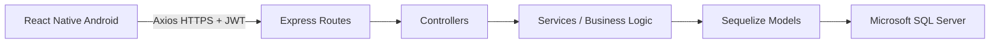
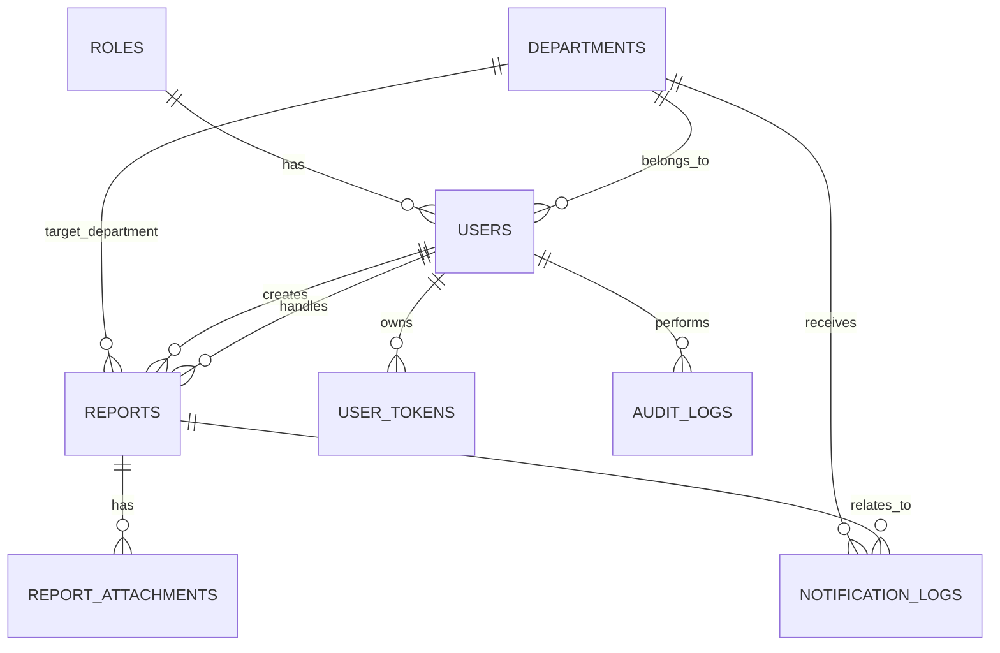

# ARSITEKTUR BARU

## Arsitektur Final

Arsitektur final aplikasi dikunci sebagai:

```text
React Native Android
        |
        | HTTPS REST API + JWT
        v
Node.js + Express.js MVC
        |
        | Sequelize ORM
        v
Microsoft SQL Server
```



Aturan arsitektur:
- React Native hanya berkomunikasi dengan Express REST API.
- React Native tidak boleh terhubung langsung ke SQL Server.
- `routes` menentukan endpoint dan middleware.
- `controllers` menangani request dan response.
- `services` menangani business logic.
- `models` menangani mapping tabel dan relasi Sequelize.
- SQL Server menjadi sumber data utama.
- Target aplikasi mobile adalah Android.

Dokumen ini menjelaskan rancangan migrasi penuh aplikasi `management_emergency` dari Flutter + Firebase menjadi React Native + Express.js + SQL Server.

## 1. Tujuan Arsitektur Baru

Target migrasi ini adalah mempertahankan seluruh fitur aplikasi lama, tetapi dengan stack baru yang lebih terkontrol dan lebih mudah diintegrasikan ke sistem internal:
- Frontend: React Native Android + TypeScript
- Navigation: React Navigation
- Data fetching: Axios + React Query
- Session storage: Async Storage
- Backend: Node.js + Express.js dengan pola MVC dan service layer
- Auth: JWT
- ORM: Sequelize
- Database: Microsoft SQL Server
- Dev network: hotspot/Wi-Fi lokal

Prinsip desain:
- UI dan flow mengikuti aplikasi Flutter lama.
- Logika bisnis dipindahkan ke backend.
- Data utama disimpan di SQL Server, bukan di Firestore.
- File gambar disimpan di storage server atau object storage yang disiapkan backend.
- Notifikasi push tetap didukung melalui backend.

## 2. Struktur Folder Frontend

### Struktur yang disarankan

```text
frontend/
  src/
    assets/
      images/
      icons/
      fonts/
    components/
      atoms/
      molecules/
      organisms/
      forms/
      cards/
      modals/
    config/
      api.ts
      env.ts
      theme.ts
    navigation/
      index.tsx
      auth-navigator.tsx
      admin-navigator.tsx
      staff-navigator.tsx
      user-navigator.tsx
    screens/
      auth/
      admin/
      staff/
      user/
      shared/
    services/
      auth-service.ts
      user-service.ts
      report-service.ts
      notification-service.ts
      location-service.ts
      file-service.ts
    store/
      auth-store.ts
      ui-store.ts
    hooks/
      use-auth.ts
      use-user.ts
      use-report.ts
      use-debounce.ts
    utils/
      formatters.ts
      validators.ts
      constants.ts
      department.ts
    types/
      auth.types.ts
      user.types.ts
      report.types.ts
      api.types.ts
    theme/
      colors.ts
      spacing.ts
      typography.ts
      shadows.ts
    app.tsx
  package.json
  tsconfig.json
  babel.config.js
  metro.config.js
  .env.example
```

### Penjelasan modul frontend

- `screens/auth/`:
  - login
  - register user
  - register staff
  - reset PIN bila diperlukan
- `screens/user/`:
  - dashboard user
  - report form
  - history
  - profile
  - detail report
- `screens/staff/`:
  - dashboard staff
  - inbox alert departemen
  - detail alert
  - form completion proof
  - history staff
  - request bantuan
- `screens/admin/`:
  - dashboard admin
  - employee directory
  - user directory
  - department detail
  - create/edit staff
  - detail user
  - history admin
- `screens/shared/`:
  - loading
  - error state
  - unsupported session state

### Komponen reusable

Komponen yang sebaiknya dibuat ulang dari UI Flutter:
- `AppHeader`
- `SectionCard`
- `PrimaryButton`
- `OutlinedButton`
- `TextField`
- `PhotoPickerCard`
- `UserAvatar`
- `StatusBadge`
- `DepartmentTile`
- `MetricCard`
- `EmptyState`
- `RatingSheet`
- `MapPreviewCard`
- `ConfirmDialog`

## 3. Struktur Folder Backend

### Struktur yang disarankan

```text
backend/
  src/
    config/
      database.ts
      jwt.ts
      swagger.ts
      cors.ts
      storage.ts
    controllers/
      auth.controller.ts
      user.controller.ts
      report.controller.ts
      department.controller.ts
      notification.controller.ts
      upload.controller.ts
      health.controller.ts
    services/
      auth.service.ts
      user.service.ts
      report.service.ts
      department.service.ts
      notification.service.ts
      upload.service.ts
      token.service.ts
    models/
      index.ts
      user.model.ts
      report.model.ts
      department.model.ts
      fcm-token.model.ts
      audit-log.model.ts
    routes/
      auth.routes.ts
      user.routes.ts
      report.routes.ts
      department.routes.ts
      notification.routes.ts
      upload.routes.ts
      index.ts
    middlewares/
      auth.middleware.ts
      role.middleware.ts
      validation.middleware.ts
      error.middleware.ts
      not-found.middleware.ts
      request-logger.middleware.ts
    validators/
      auth.validator.ts
      user.validator.ts
      report.validator.ts
      department.validator.ts
    utils/
      api-response.ts
      pagination.ts
      department.ts
      logger.ts
      file-path.ts
    docs/
      swagger.ts
    app.ts
    server.ts
  tests/
  migrations/
  seeders/
  .env.example
  package.json
```

### Peran masing-masing lapisan

- `controllers`:
  - menerima request
  - validasi input dasar
  - memanggil service
  - mengirim response
- `services`:
  - berisi business logic
  - transaksi database
  - hashing PIN 6 angka
  - pembuatan token JWT
  - update status report
  - kirim notifikasi
- `models`:
  - definisi Sequelize
  - relasi antar tabel
- `middlewares`:
  - autentikasi JWT
  - otorisasi role
  - validasi schema
  - error handling
  - logging request

## 4. Database Schema

### Entitas inti

1. `Users`
2. `Roles`
3. `Departments`
4. `Reports`
5. `ReportAttachments`
6. `UserTokens`
7. `NotificationLogs`
8. `AuditLogs`

### Struktur tabel yang disarankan

#### `Roles`
- `role_id` PK
- `role_name` unique
- `description`

#### `Departments`
- `department_id` PK
- `department_code` unique
- `department_name`
- `description`
- `icon`
- `color`
- `is_active`

#### `Users`
- `user_id` PK
- `role_id` FK -> `Roles`
- `department_id` FK -> `Departments`, nullable
- `full_name`
- `username` unique
- `email` unique
- `password_hash` menyimpan hash bcrypt PIN 6 angka
- `phone_number`
- `photo_url`
- `approval_status` enum: `pending`, `approved`, `rejected`
- `approved_by` FK -> `Users`, nullable
- `approved_at`
- `is_active`
- `created_at`
- `updated_at`

#### `Reports`
- `report_id` PK
- `department_id` FK -> `Departments`
- `reporter_user_id` FK -> `Users`
- `source_department_id` FK -> `Departments`, nullable
- `assigned_staff_id` FK -> `Users`, nullable
- `description`
- `incident_location_text`
- `incident_latitude`
- `incident_longitude`
- `status` enum: `open`, `progress`, `close`
- `created_at`
- `updated_at`
- `progress_started_at`
- `arrived_at`
- `completed_at`
- `resolution_minutes`
- `completion_description`
- `rating_score`
- `rating_comment`
- `rated_at`

#### `ReportAttachments`
- `attachment_id` PK
- `report_id` FK -> `Reports`
- `attachment_type` enum: `incident_photo`, `completion_photo`
- `file_name`
- `file_url`
- `mime_type`
- `file_size`
- `created_at`

#### `UserTokens`
- `token_id` PK
- `user_id` FK -> `Users`
- `platform` enum: `android`
- `fcm_token`
- `device_id`
- `last_seen_at`
- `created_at`
- `updated_at`

#### `NotificationLogs`
- `notification_log_id` PK
- `report_id` FK -> `Reports`, nullable
- `target_department_id` FK -> `Departments`
- `notification_type` enum: `new_alert`, `alert_taken`, `alert_closed`
- `title`
- `body`
- `success_count`
- `failure_count`
- `payload_json`
- `created_at`

#### `AuditLogs`
- `audit_log_id` PK
- `actor_user_id` FK -> `Users`
- `entity_type`
- `entity_id`
- `action`
- `before_json`
- `after_json`
- `created_at`

### Indeks yang penting

- `Users.email`
- `Users.username`
- `Users.role_id`
- `Users.department_id`
- `Users.approval_status`
- `Reports.department_id`
- `Reports.reporter_user_id`
- `Reports.assigned_staff_id`
- `Reports.status`
- `Reports.created_at`
- `ReportAttachments.report_id`
- `UserTokens.user_id`
- `UserTokens.fcm_token`

### Catatan desain

- `approval_status` staff harus dipisah dari `role`.
- `Reports` menyimpan koordinat asli, bukan hanya string lokasi.
- Foto kejadian dan bukti selesai dipisah ke tabel attachment agar fleksibel.
- Token FCM dipisah ke tabel sendiri agar support multi-device.

## 5. ERD Konseptual



## 6. API Design

### Konvensi umum

- Base URL: `https://api.domain-anda.com/api`
- Format response konsisten:
  - `success`
  - `message`
  - `data`
  - `meta`
  - `errors`
- Semua endpoint sensitif harus memakai JWT
- Semua request CRUD memakai validasi input
- Semua response error harus seragam

### Endpoint auth

- `POST /auth/login`
- `POST /auth/register-user`
- `POST /auth/register-staff`
- `POST /auth/logout`
- `POST /auth/refresh`
- `GET /auth/me`
- `PATCH /auth/change-pin`

### Endpoint users

- `GET /users`
- `GET /users/:id`
- `POST /users`
- `PUT /users/:id`
- `DELETE /users/:id`
- `PATCH /users/:id/approve`
- `PATCH /users/:id/reject`
- `GET /users/staff/pending`
- `GET /users/staff/approved`

### Endpoint reports

- `GET /reports`
- `GET /reports/:id`
- `POST /reports`
- `PUT /reports/:id`
- `PATCH /reports/:id/status`
- `PATCH /reports/:id/progress`
- `PATCH /reports/:id/arrived`
- `PATCH /reports/:id/complete`
- `PATCH /reports/:id/rate`
- `DELETE /reports/:id`
- `GET /reports/by-department/:departmentId`
- `GET /reports/by-user/:userId`
- `GET /reports/by-staff/:staffId`

### Endpoint departments

- `GET /departments`
- `GET /departments/:id`
- `POST /departments`
- `PUT /departments/:id`
- `DELETE /departments/:id`
- `GET /departments/:id/stats`

### Endpoint notifications

- `POST /notifications/register-token`
- `POST /notifications/remove-token`
- `POST /notifications/send-alert`
- `POST /notifications/alert-taken`
- `GET /notifications/logs`

### Endpoint upload

- `POST /uploads/profile-photo`
- `POST /uploads/report-photo`
- `POST /uploads/report-completion-photo`

### Endpoint health dan dokumentasi

- `GET /health`
- `GET /docs`

## 7. Auth Flow

### Alur login

1. User memasukkan username dan PIN 6 angka.
2. Frontend mengirim request ke `POST /auth/login`.
3. Backend validasi user dan role.
4. Jika valid:
   - backend mengeluarkan `accessToken` JWT
   - backend mengeluarkan `refreshToken`
   - frontend menyimpan token di Async Storage
5. Frontend memanggil `GET /auth/me` untuk mendapatkan profil aktif.
6. Navigation diarahkan berdasarkan role:
   - admin
   - staff
   - user

### Alur registrasi user

1. User isi form registrasi.
2. Backend membuat akun dengan role `user`.
3. Status approval langsung `approved`.
4. User bisa login setelah registrasi berhasil.

### Alur registrasi staff

1. Staff mengisi form pengajuan.
2. Backend menyimpan akun dengan status `pending`.
3. Admin menerima notifikasi/pengajuan di dashboard admin.
4. Admin approve/reject.
5. Jika approve, staff dapat login.

### Alur session

- `accessToken` dipakai untuk akses API harian.
- `refreshToken` dipakai saat access token kedaluwarsa.
- Async Storage menyimpan:
  - access token
  - refresh token
  - profil user ringkas
  - preferensi session

## 8. Flow Frontend

### Flow aplikasi React Native

1. App start.
2. Cek token di Async Storage.
3. Jika ada token:
   - call `/auth/me`
   - load role
   - masuk ke navigator yang sesuai
4. Jika tidak ada token:
   - tampil auth stack
5. Setelah login:
   - mount navigator role-based
   - preload data dashboard dengan React Query

### Pattern data fetching

- React Query untuk:
  - list report
  - detail report
  - list user
  - dashboard stats
  - profile user
  - department stats
- Axios untuk:
  - request HTTP
  - interceptor auth header
  - auto refresh token

## 9. Flow Backend

### Request lifecycle

1. Request masuk ke Express.
2. Middleware log request.
3. Middleware JWT memverifikasi token.
4. Middleware role cek izin akses.
5. Validator memeriksa payload.
6. Controller memanggil service.
7. Service menjalankan transaksi Sequelize.
8. Response dikirim dengan format standar.

### Error handling

- Input invalid -> 400
- Unauthorized -> 401
- Forbidden -> 403
- Not found -> 404
- Server error -> 500
- Semua error dicatat ke logger

## 10. Deployment Flow

### Pengembangan lokal

Frontend:
- Jalankan Metro bundler
- Pakai `.env` untuk API URL

Backend:
- Jalankan Express lokal
- Hubungkan ke SQL Server lokal atau instance dev
- Expose backend lewat IP lokal hotspot/Wi-Fi

### Flow hotspot lokal

1. Backend jalan di port lokal, misalnya `3000`.
2. Laptop dan HP tersambung ke hotspot atau Wi-Fi yang sama.
3. Cari IP lokal laptop, misalnya `192.168.1.10`.
4. Simpan URL IP lokal ke `.env` frontend.
5. Frontend mobile memanggil backend via URL IP lokal.

### Flow produksi

- Frontend:
  - build release Android/iOS
- Backend:
  - deploy ke server VPS/managed hosting
- Database:
  - SQL Server production
- Storage:
  - file disimpan ke server/object storage
- Notifikasi:
  - backend menggunakan service account / provider push yang disiapkan

## 11. Konfigurasi Lingkungan

### Frontend `.env.example`

- `API_BASE_URL`
- `APP_ENV`
- `GOOGLE_MAPS_API_KEY` jika dipakai
- `SENTRY_DSN` jika dipakai

### Backend `.env.example`

- `PORT`
- `NODE_ENV`
- `JWT_ACCESS_SECRET`
- `JWT_REFRESH_SECRET`
- `JWT_ACCESS_EXPIRES_IN`
- `JWT_REFRESH_EXPIRES_IN`
- `DB_HOST`
- `DB_PORT`
- `DB_NAME`
- `DB_USER`
- `DB_PASSWORD`
- `DB_DIALECT`
- `STORAGE_PROVIDER`
- `UPLOAD_DIR`
- `PUBLIC_ASSET_BASE_URL`
- `FCM_SERVICE_ACCOUNT_PATH` atau kredensial push lain yang dipilih

## 12. Mapping Fitur Lama ke Arsitektur Baru

### Dari Firebase ke SQL Server

- `users` Firestore -> `Users`, `Roles`, `UserTokens`
- `reports` Firestore -> `Reports`, `ReportAttachments`
- `_meta` -> tabel konfigurasi/migrasi bila diperlukan

### Dari Firebase Auth ke JWT

- Firebase Auth -> login custom backend
- Sesi Firebase -> JWT access/refresh token
- Approval staff tetap dipertahankan di database

### Dari Firebase Storage

- Storage Firebase -> storage backend sendiri atau object storage
- URL file disimpan di database SQL Server

### Dari FCM backend lama

- Backend notifikasi lama -> service notification di backend Express

## 13. Rekomendasi Teknis

- Gunakan struktur feature-based di frontend agar screen dan service mudah dirawat.
- Gunakan transaction Sequelize saat:
  - create report + attachment
  - approve staff
  - complete report
  - rate report
- Gunakan soft delete untuk data penting jika audit diperlukan.
- Simpan semua tanggal dalam format UTC di database.
- Frontend cukup menampilkan tanggal lokal sesuai locale Indonesia.

## 14. Output yang Akan Dibuat di Fase Berikutnya

Berdasarkan arsitektur ini, fase selanjutnya akan menghasilkan:
- `DATABASE_DESIGN.md`
- `database.sql`
- backend Express lengkap
- frontend React Native TypeScript
- integrasi environment
- testing dan dokumentasi

## 15. Kesimpulan

Arsitektur baru ini mempertahankan seluruh alur bisnis aplikasi lama, tetapi memindahkan otoritas data dan logika bisnis ke backend Express + SQL Server. Hasilnya adalah sistem yang:
- lebih mudah diuji
- lebih mudah dikontrol
- lebih mudah diintegrasikan ke aplikasi mobile modern
- lebih siap untuk pengembangan jangka panjang
