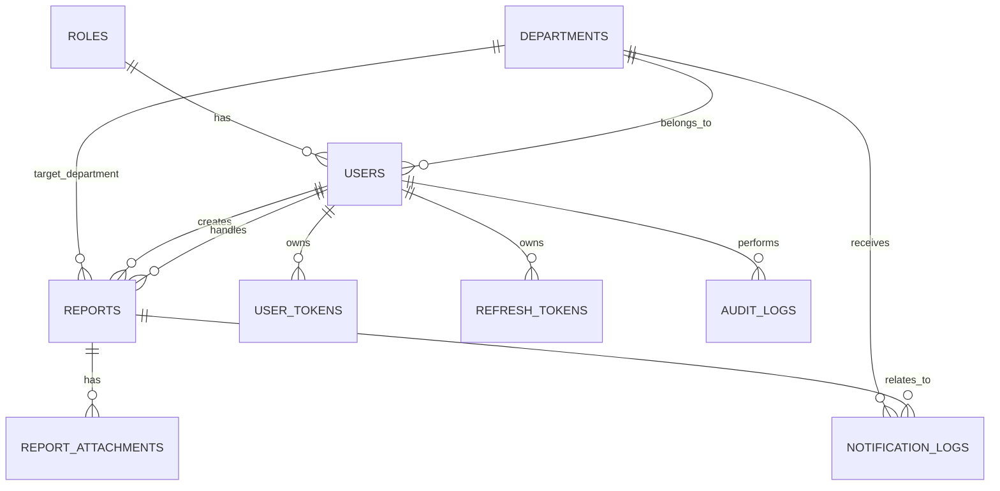

# DATABASE DESIGN - SQL Server

Dokumen ini menjabarkan konversi struktur Firestore pada aplikasi `management_emergency` ke desain Microsoft SQL Server untuk stack baru React Native + Express.js + Sequelize.

## 1. Tujuan Desain

Target desain database ini adalah:
- menggantikan koleksi Firestore dengan tabel relasional
- mempertahankan alur bisnis lama: user, staff, admin, report, attachment, notifikasi, dan audit
- mendukung JWT refresh token
- mendukung multi-device push token
- mudah di-query untuk dashboard dan histori

## 2. Mapping Firestore ke SQL Server

### Koleksi Firestore lama
- `users`
- `reports`
- `_meta`

### Pemetaan ke SQL Server

| Firestore | SQL Server | Catatan |
|---|---|---|
| `users` | `roles`, `users`, `user_tokens`, `refresh_tokens` | `role` dipisah ke tabel `roles`, token dipisah agar normalisasi lebih baik |
| `reports` | `reports`, `report_attachments`, `notification_logs`, `audit_logs` | attachment dan log dipisah agar 1 report bisa punya banyak file dan jejak aktivitas |
| `_meta` | proses migrasi / seed / ETL | dipakai hanya saat migrasi awal, bukan data operasional utama |

## 3. Entitas Inti

1. `roles`
2. `departments`
3. `users`
4. `refresh_tokens`
5. `user_tokens`
6. `reports`
7. `report_attachments`
8. `notification_logs`
9. `audit_logs`

## 4. ERD Konseptual

## 5. Desain Tabel

### 5.1 `roles`

Menyimpan role sistem.

- `role_id` PK, identity
- `role_name` unique
- `description`

Contoh data:
- `admin`
- `staff`
- `user`

### 5.2 `departments`

Menyimpan daftar departemen emergency.

- `department_id` PK, identity
- `department_code` unique
- `department_name`
- `description`
- `icon`
- `color`
- `is_active`

### 5.3 `users`

Menyimpan akun admin, staff, dan user.

- `user_id` PK, identity
- `role_id` FK -> `roles.role_id`
- `department_id` FK -> `departments.department_id`, nullable
- `full_name`
- `username` unique
- `email` unique
- `password_hash` (hash bcrypt dari PIN 6 angka)
- `phone_number`
- `photo_url`
- `approval_status` = `pending | approved | rejected`
- `approved_by_user_id` FK -> `users.user_id`, nullable
- `approved_at`
- `is_active`
- `last_login_at`
- `created_at`
- `updated_at`

### 5.4 `refresh_tokens`

Menyimpan refresh token JWT yang sudah di-hash.

- `refresh_token_id` PK, identity
- `user_id` FK -> `users.user_id`
- `token_hash` unique
- `expires_at`
- `revoked_at`
- `created_at`

### 5.5 `user_tokens`

Menyimpan token push per device.

- `token_id` PK, identity
- `user_id` FK -> `users.user_id`
- `platform` = `android`
- `fcm_token` unique
- `device_id`
- `last_seen_at`
- `created_at`
- `updated_at`

### 5.6 `reports`

Menyimpan alert/report utama.

- `report_id` PK, identity
- `department_id` FK -> `departments.department_id`
- `reporter_user_id` FK -> `users.user_id`
- `source_department_id` FK -> `departments.department_id`, nullable
- `assigned_staff_id` FK -> `users.user_id`, nullable
- `description`
- `incident_location_text`
- `incident_latitude`
- `incident_longitude`
- `status` = `open | progress | close`
- `progress_started_at`
- `arrived_at`
- `completed_at`
- `resolution_minutes`
- `completion_description`
- `rating_score`
- `rating_comment`
- `rated_at`
- `created_at`
- `updated_at`

### 5.7 `report_attachments`

Menyimpan lampiran report.

- `attachment_id` PK, identity
- `report_id` FK -> `reports.report_id`
- `attachment_type` = `incident_photo | completion_photo`
- `file_name`
- `file_url`
- `mime_type`
- `file_size`
- `created_at`

### 5.8 `notification_logs`

Menyimpan jejak pengiriman notifikasi.

- `notification_log_id` PK, identity
- `report_id` FK -> `reports.report_id`, nullable
- `target_department_id` FK -> `departments.department_id`
- `notification_type`
- `title`
- `body`
- `success_count`
- `failure_count`
- `payload_json`
- `created_at`

### 5.9 `audit_logs`

Menyimpan aktivitas penting untuk audit.

- `audit_log_id` PK, identity
- `actor_user_id` FK -> `users.user_id`, nullable
- `entity_type`
- `entity_id`
- `action`
- `before_json`
- `after_json`
- `created_at`

## 6. Primary Key

- `roles.role_id`
- `departments.department_id`
- `users.user_id`
- `refresh_tokens.refresh_token_id`
- `user_tokens.token_id`
- `reports.report_id`
- `report_attachments.attachment_id`
- `notification_logs.notification_log_id`
- `audit_logs.audit_log_id`

## 7. Foreign Key

- `users.role_id` -> `roles.role_id`
- `users.department_id` -> `departments.department_id`
- `users.approved_by_user_id` -> `users.user_id`
- `refresh_tokens.user_id` -> `users.user_id`
- `user_tokens.user_id` -> `users.user_id`
- `reports.department_id` -> `departments.department_id`
- `reports.reporter_user_id` -> `users.user_id`
- `reports.source_department_id` -> `departments.department_id`
- `reports.assigned_staff_id` -> `users.user_id`
- `report_attachments.report_id` -> `reports.report_id`
- `notification_logs.report_id` -> `reports.report_id`
- `notification_logs.target_department_id` -> `departments.department_id`
- `audit_logs.actor_user_id` -> `users.user_id`

## 8. Index

### `users`
- unique `UX_users_username`
- unique `UX_users_email`
- index `IX_users_role_id`
- index `IX_users_department_id`
- index `IX_users_approval_status`
- index `IX_users_is_active`

### `departments`
- unique `UX_departments_department_code`
- index `IX_departments_is_active`

### `refresh_tokens`
- unique `UX_refresh_tokens_token_hash`
- index `IX_refresh_tokens_user_id`
- index `IX_refresh_tokens_expires_at`

### `user_tokens`
- unique `UX_user_tokens_fcm_token`
- index `IX_user_tokens_user_id`

### `reports`
- index `IX_reports_department_id`
- index `IX_reports_reporter_user_id`
- index `IX_reports_assigned_staff_id`
- index `IX_reports_source_department_id`
- index `IX_reports_status`
- index `IX_reports_created_at`
- composite index `IX_reports_department_status_created_at`

### `report_attachments`
- index `IX_report_attachments_report_id`
- index `IX_report_attachments_type`

### `notification_logs`
- index `IX_notification_logs_report_id`
- index `IX_notification_logs_target_department_id`
- index `IX_notification_logs_created_at`

### `audit_logs`
- index `IX_audit_logs_actor_user_id`
- index `IX_audit_logs_entity`
- index `IX_audit_logs_created_at`

## 9. Relasi Data

### Relasi utama
- `roles (1) -> (N) users`
- `departments (1) -> (N) users`
- `departments (1) -> (N) reports`
- `users (1) -> (N) reports` sebagai pelapor
- `users (1) -> (N) reports` sebagai staff penanggung jawab
- `reports (1) -> (N) report_attachments`
- `users (1) -> (N) user_tokens`
- `users (1) -> (N) refresh_tokens`
- `reports (1) -> (N) notification_logs`
- `users (1) -> (N) audit_logs`

### Catatan relasi
- `reporter_user_id` menyimpan akun pembuat alert.
- `assigned_staff_id` menyimpan staff yang menangani alert.
- `source_department_id` dipakai untuk bantuan lintas departemen.
- `approval_status` memisahkan status approval staff dari role.

## 10. Mapping Field Firestore ke SQL

### `users`
- `id` -> `user_id`
- `name` -> `full_name`
- `username` -> `username`
- `email` -> `email`
- `pin` -> `password_hash`
- `role` -> `role_id`
- `department` -> `department_id`
- `jobFunction` -> disimpan sebagai bagian deskripsi profil bila diperlukan
- `phoneNumber` -> `phone_number`
- `photoPath` -> `photo_url`
- `approvalStatus` -> `approval_status`
- `approvedBy` -> `approved_by_user_id`
- `approvedAt` -> `approved_at`

### `reports`
- `id` -> `report_id`
- `department` -> `department_id`
- `description` -> `description`
- `location` -> `incident_location_text`
- `imagePath` / `imageData` -> `report_attachments`
- `timestamp` -> `created_at`
- `reporterName` / `reporterEmail` -> `reporter_user_id`
- `sourceDepartment` -> `source_department_id`
- `status` -> `status`
- `completionDescription` -> `completion_description`
- `completionImagePath` / `completionImageData` -> `report_attachments`
- `completedAt` -> `completed_at`
- `assignedStaffName` / `assignedStaffEmail` -> `assigned_staff_id`
- `responderLocation` -> log event terpisah bila diperlukan
- `progressStartedAt` -> `progress_started_at`
- `arrivedAt` -> `arrived_at`
- `resolutionMinutes` -> `resolution_minutes`
- `ratingScore` -> `rating_score`
- `ratingComment` -> `rating_comment`
- `ratedAt` -> `rated_at`

## 11. Strategi Migrasi dari Firestore

1. Seed `roles` dan `departments` terlebih dahulu.
2. Migrasikan `users` Firestore:
   - cocokkan role
   - normalisasi department
   - hash ulang PIN jika dibutuhkan
3. Migrasikan `reports` Firestore:
   - resolve `reporter_user_id` dan `assigned_staff_id`
   - pindahkan attachment ke `report_attachments`
4. Import notifikasi dan audit jika ada riwayat yang tersedia.
5. Simpan data `_meta` sebagai log migrasi terpisah atau abaikan setelah validasi selesai.

## 12. Keputusan Desain

- PIN tidak disimpan plain text dan selalu di-hash dengan bcrypt.
- Attachment tidak disimpan di tabel `reports` agar laporan bisa punya banyak lampiran.
- Token JWT refresh dipisah untuk mendukung logout per device.
- Push token dipisah untuk mendukung banyak perangkat per user.
- Semua tanggal disimpan sebagai `DATETIME2` UTC.

## 13. Kesimpulan

Desain SQL Server ini mempertahankan seluruh domain penting dari Firestore lama, tetapi menormalisasi data supaya:
- query dashboard lebih cepat
- validasi relasi lebih kuat
- audit dan histori lebih rapi
- backend Express lebih mudah dikelola
